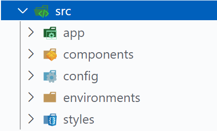
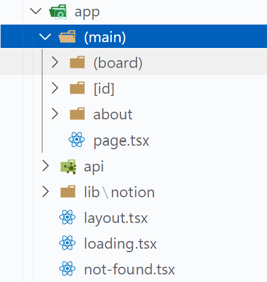

# Next.js 13 + Notion API Blog

> 운영중인 블로그는 없고 평소에 노션을 주로 사용하고 있었다. 그래서 노션API를 이용해서 블로그를 만들면 DB도 서버도 필요없으니까 더 쉽게 운영할 수 있지 않을까는 생각에 개발을 시작했다.
>
> **개발기간**: 2023.08. ~ 2023.09.

<br/>

<div align=center>

  <br/>

  

  <br/>

</div>

<br/>

**주요기술:**


  
**사이트 보러가기** 👉 [Beauty Kim Blog Site😎](https://beauty-kim-app.vercel.app/)

<br/>
<br/>

# 개발과정

## 1. 개발환경 정하기

개발을 처음 배웠던 2022년까지만 해도 React를 뽑는 회사는 가뭄에 콩 나듯했는데 Next.js를 뽑는 회사는 더더욱 없었다.  
그런데 최근 취업시장에 Next.js를 키워드로 검색하면 생각보다 많은 회사가 보여 프레임워크로는 Next.js를 사용하기로 했다.

<br/>
<br/>

## 2. UI 디자인

최대한 깔끔하고 예쁘지만 관리하기는 쉬운 디자인을 원했지만 그런 디자인은 불가능했고, 노션API와 디자인 요소 하나하나와 연결하는 과정이 생각보다 쉽지 않아서 일단 깔끔한 디자인으로 진행하고 개발 완료 후 디자인을 변경하는 방향으로 정했다.

<br/>

**디자인 참고 사이트**

- [Velog](https://velog.io/)
- Notion

<br/>
<br/>

## 3. 개발

(1) 노션에서 API키 발급받기

- 키를 발급 받는 페이지를 찾는 방법은 다양하다. 노션 페이지 > 설정과 멤버 > 내 연결 > API 연결 개발 또는 관리 또는 Notion Developers 페이지에서 View my integrations 아니면 아래의 링크를 통해 들어가는 것이 가장 쉽다.
  - 링크: https://www.notion.so/my-integrations
- 사이트에 틀어가면 새 API 통합 만들기를 클릭하고 시키는대로 하면 간단하게 키가 발급된다.

<br/>

(2) 프로젝트 생성

- Next.js 프로젝트 생성

  ```
  npx create-next-app@latest
  ```

  - Would you like to use TypeScript? -- Yes!
  - Would you like to use Tailwind CSS? -- No!

- 디렉토리 구조 정하기

  - 기존에 pages/ 디렉토리에서 라우팅 되던 방식과 다르게, app/ 디렉토리로 라우팅 하는 방식이 추가됐다고 해서 여러 github의 레파지토리를 참고 삼아 내 프로젝트에 맞게 구조를 잡았다.

  <br/>

  ```
    - app: 라우팅, api, notion 라이브러리
    - components: UI 요소
    - config: notion API 통신
    - environments: 환경
    - styles: css
  ```

    <br/>

    <div align=center>
    
    </div>

    <br/>

  ```
  app 하위에는 라우팅 역할을 하는 (main), notion api를 커스텀한 라이브러리 lib 폴더가 있다.
  ```

  <br/>

     <div align=center>
    
    </div>

    <br/>

(3) 노션 API 연동

- 작성중

<br/>
<br/>

**개발 참고 사이트**

- [Building a blog with Notions public API](https://samuelkraft.com/blog/building-a-notion-blog-with-public-api)
- [화해: Notion API와 함께 정적 페이지로의 여정](https://blog.hwahae.co.kr/all/tech/10960)
- [JaeSeoKim's Blog: Notion API 분석해보기!(feat. Next.js)](https://jaeseokim.dev/Javascript/analysis-notion-api-feat_nextjs_part_1/)
- [[Youtube: 개발하는 정대리]Next.js 나만의 포트폴리오 사이트 만들기 (개발하는 김에 배포까지)](https://www.youtube.com/watch?v=KvoFvmu5eRo&embeds_referring_euri=https%3A%2F%2Fwww.notion.so%2F&source_ve_path=MjM4NTE&feature=emb_title)
